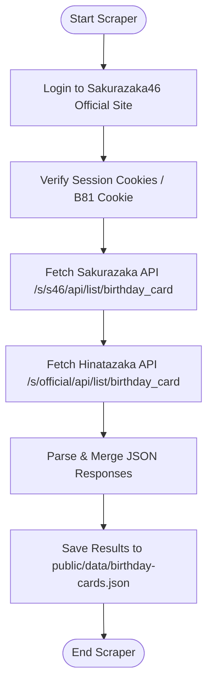
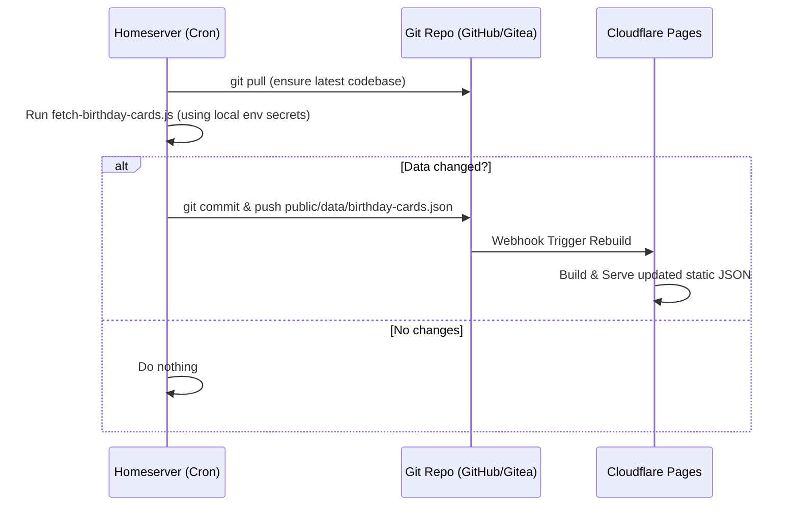

# Sakurazaka46 & Hinatazaka46 Birthday Cards Scraper & UI Architecture

This document describes the simple, single-script scraper architecture for extracting member birthday card image URLs from both Sakurazaka46 and Hinatazaka46 official sites, and the deployment / frontend presentation strategy.

## Logic Flow

## Cron Job Deployment Flow

Since Cloudflare Pages is static and does not run cron jobs, and the scraper requires credentials (`SAKURAZAKA_EMAIL`/`SAKURAZAKA_PASSWORD`), running the cron job on the **Homeserver** is the most secure and practical approach. The credentials remain local to the Homeserver.

## Key Components

1. **Authentication Loop (Sakurazaka46)**
   - Retrieves `SAKURAZAKA_EMAIL` and `SAKURAZAKA_PASSWORD` from environment.
   - Bootstraps by hitting the login/artist pages to obtain `my_webckid`.
   - Submits credentials via a POST request to obtain session cookies (`B81AC560F83BFC8C`).
   - Verifies session validity against a radio diary endpoint.

2. **API Data Extraction**
   - **Sakurazaka46**: Calls the official backend API endpoint `/s/s46/api/list/birthday_card` with authenticated cookies.
   - **Hinatazaka46**: Directly calls the public API endpoint `/s/official/api/list/birthday_card` (currently does not require session authentication).
   - Extracts member names, IDs, birthday card image URLs, and profile photos.

3. **Data Serialization**
   - Maps the API data to the unified format containing `member`, `memberId`, `cardUrl`, `pageUrl`, `group`, and `month`.
   - Writes the merged and deduplicated payload directly to `public/data/birthday-cards.json`.

4. **Frontend Presentation (UI)**
   - Display a responsive, premium grid with interactive filters (group selection: "全部" / "樱坂46" / "日向坂46", dynamic generation tabs, and name search).
   - Use corrected, verified local database mapping for all active members' birthdays to ensure accuracy.
   - Implement a premium in-page Modal viewer for card preview, download, and original detail page links.

