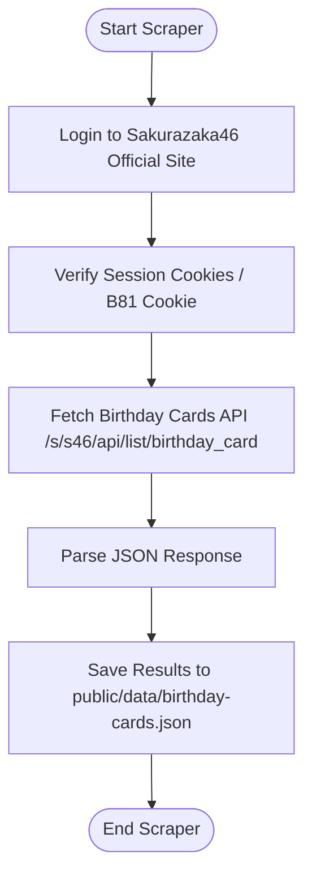
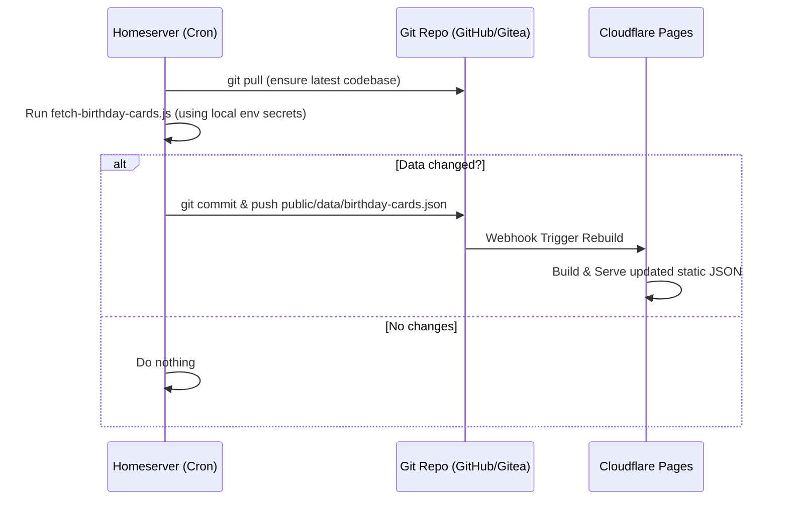

# Sakurazaka46 Birthday Cards Scraper & UI Architecture

This document describes the simple, single-script scraper architecture for extracting member birthday card image URLs from the Sakurazaka46 official site, and the deployment / frontend presentation strategy.

## Logic Flow

## Cron Job Deployment Flow

Since Cloudflare Pages is static and does not run cron jobs, and the scraper requires credentials (`SAKURAZAKA_EMAIL`/`SAKURAZAKA_PASSWORD`), running the cron job on the **Homeserver** is the most secure and practical approach. The credentials remain local to the Homeserver.

## Key Components

1. **Authentication Loop**
   - Retrieves `SAKURAZAKA_EMAIL` and `SAKURAZAKA_PASSWORD` from environment.
   - Bootstraps by hitting the login/artist pages to obtain `my_webckid`.
   - Submits credentials via a POST request to obtain session cookies (`B81AC560F83BFC8C`).
   - Verifies session validity against a radio diary endpoint.

2. **API Data Extraction**
   - Directly calls the official backend API endpoint `/s/s46/api/list/birthday_card` with authenticated cookies.
   - Parses the JSON response which contains the list of all members, their name, profile photo, and birthday card image source.

3. **Data Serialization**
   - Maps the API data to the required format.
   - Writes the final payload directly to `public/data/birthday-cards.json`.

4. **Frontend Presentation (UI)**
   - Display a responsive, premium grid with interactive filters (generation, name search).
   - Celebrate today's/this month's birthday members at the top.
   - Implement a premium in-page Modal viewer for card preview, download, and original detail page links.
